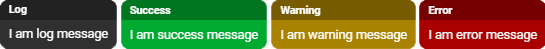

# Noty JS


<p align="center">
	<a href="https://github.com/psyll/Noty-JS/blob/master/LICENSE">
		
	</a>
	
	
	
	
</p>

## Table of contents
* [Introduction](#introduction)
* [Installation](#installation)
* [Plugin initialization](#plugin-initialization)
* [Create notification](#create-notification)
* [Create confirmation with buttons](#create-confirmation-with-buttons)
* [Authors](#authors)
* [Changelog](#changelog)
* [License](#license)

## Introduction

**Noty** is a versatile javascript library designed to provide a simple and efficient solution for notifications on any website. With its focus on being lightweight, Noty doesn't require any additional dependencies, making it a hassle-free choice for web developers. Notifications can be customized with ease to match the look and feel of your website, giving you complete control over the appearance of your notifications.

_________________

<p align="center">
	
</p>

_________________

The plugin comes with several pre-defined templates, allowing you to quickly create notifications with a consistent design. Additionally, you can create your own templates to suit specific requirements, such as highlighting important messages or emphasizing specific information. Noty is also flexible enough to allow you to set the position, animation, and duration of notifications, giving you full control over how your notifications are displayed.

In conclusion, Noty is an ideal solution for those who want a quick and easy way to add notifications and confirmations to their website. With its lightweight design, customizable templates, and flexible settings, Noty is a must-have tool for any web developer.

## Installation

To install the Noty plugin, add the following code to your HTML file:

```html
<script src="<noty-folder>/noty.min.js"></script>
<link rel="stylesheet" href="<noty-folder>/noty.min.css" />
```

Make sure to replace `<noty-folder>` with the actual file path where you have stored the Noty plugin files.

## Plugin initialization

It's easy to initialize the Noty plugin with default parameters. Simply use the following code:
```javascript
const noty = new Noty();
```
However, you can still customize your notifications by adding parameters to the code. For example:

```javascript
const noty = new Noty({
  hoverPause: true,
  timeout: 4000,
  position: "right-bottom",
  animation: "slide-right fade flip zoom",
});
```

Parameters are used to define the position and settings of notifications.

- **`hoverPause`** (default: false) - Pauses the timeout when hovering notification
- **`timeout`** (default: 0) - The default time period until the notification automatically closes (in milliseconds)
- **`position`** (default: right-bottom) - The position where the notifications are displayed. Allowed positions: `top`, `right-top`, `right`, `right-bottom`, `bottom`, `left-bottom`, `left`, `left-top`
- **`animation`** (default: null) - The names of the animations. Allowed animations: `slide-bottom`, `slide-right`, `fade`, `flip`, `zoom`

With these variables defined, you can easily customize your notifications to fit your needs and enhance the user experience on your website.

## Create notification

To create a simple notification, use the following code:

```javascript
noty.push({text: "I am a log message"});
```

This will create a basic log message. However, you can also expand the notification by adding additional parameters, such as:

```javascript
noty.push({
  type: "log",
  title: "Log",
  text: "I am a log message",
  clickClose: true,
  timeout: 4000,
});
```

The variables include:

- **`type`** (default: log) - The type of notification. Allowed types are: `log`, `success`, `warning`, `error`
- **`title`** (default: null) - The header of the notification
- **`text`** (* required) - The content of the notification
- **`clickClose`** (default: true) - Remove notification after click on it
- **`timeout`** - The time period until the specific notification automatically closes (in milliseconds). The default value is taken from the plugin initialization.
- **`buttons`** - The buttons object

<p align="center">
	
</p>

## Create confirmation with buttons

To generate buttons for notifications, you can use the "buttons" parameter of the "push" method. The "buttons" parameter accepts an object where each property represents a button.

```javascript
noty.push({
  text: 'Confirmation text',
  buttons: {
  	ok: {
  		text: "OK",
  		action: function () {
  			alert('OK button clicked');
  		}
   	},
   	close: {
   		text: 'Close',
   		action: function () {
   			alert('Close button clicked');
  		},
   		close: true
   	},
  }
});
```

In this code, we are using the `noty.push()` method to create a new notification. The text property is used to set the confirmation message, while the buttons property is used to specify the available buttons in the notification.

Each button has its own text property which sets the label for the button, and action property, which specifies the function that will be executed when the button is clicked. The close property, which is set to true is used to indicate that the notification should be closed when the button is clicked.

 A more advanced version of the code could look like this:

```javascript
noty.push({
  type: 'warning',
  title: 'Confirmation title',
  text: 'Confirmation text',
  timeout: 4000,
  buttons: {
  	ok: {
  	  classname: "noty-button-true",
  		text: "OK",
  		action: function () {
  			alert('OK button clicked');
  		}
  	},
  	close: {
  		classname: "noty-button-false",
  		text: 'Close',
  		action: function () {
  			alert('Close button clicked');
  		},
  		close: true
  	},
  }
});
```

In this version, we are using the type property to set the notification type to "warning", and the title property to set a title for the notification. The timeout property is used to specify the duration of the notification, in milliseconds, before it is automatically closed. The classname property is used to set custom classnames for the buttons, allowing you to style them with CSS.

## Authors

- `Jarek Szulc` <jarek@psyll.com>
- `Psyll.com` <dev@psyll.com>

## Changelog

[View changelog](https://github.com/psyll/Noty-JS/blob/master/CHANGELOG.md)

## License

Licensed under the `MIT License`

[View license](https://github.com/psyll/Noty-JS/blob/master/LICENSE)
